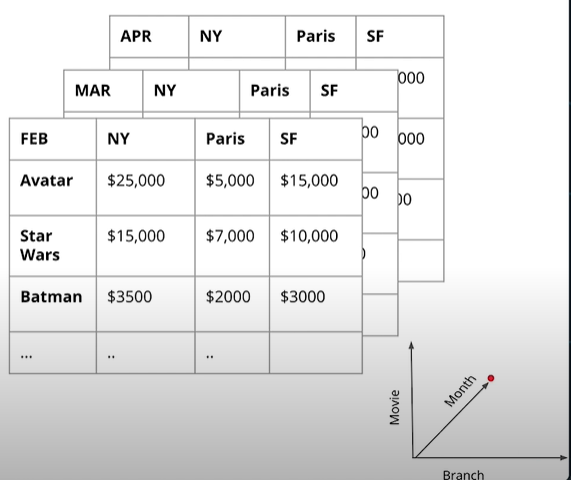

# OLAP Cubes

- an aggregation of fact metric on a number of dimensions
- eg. movie branch, month
- easy to communicate to business users
- common OLAP operations include:
    - rollup - eg. sum up multiple columns in a dimension (eg. all countries in a branch)
    - drill-down - get more details about a column (eg. cities from each country)
    - slice - fix a dimension to a single value (eg. month=MART), a slice
    - dice - compute a sub-cube (eg. month in [FEB, MAR] and branch=NY)
- should store the finest grain of data (atomic data) in order to be able to drill-down

- GROUP BY CUBE
    - one pass through the facts
    - will aggregate all possible combination of groupings
    - eg. CUBE(movie, branch, month) will produce all combinations
        - by each movie, branch, month
        - by to dimensions (movie, branch), (movie, month), (branch, month)
        - by all together
    - can save/materialize the output

- GROUP BY GROUPING SETS
    - Eg. () nothing, one, two or three dimensions
    - results include subtotals with expressive None

## Technologies

- Pre-aggregate MOLAP - multi dimensional db, special purpose
- ROLAP - compute OLAP cubes on the fly

### Column format
- postgress columnar using columnar table extension (cstore_ftw)
- faster than raw storage (columnar 158ms vs 217ms normal)

