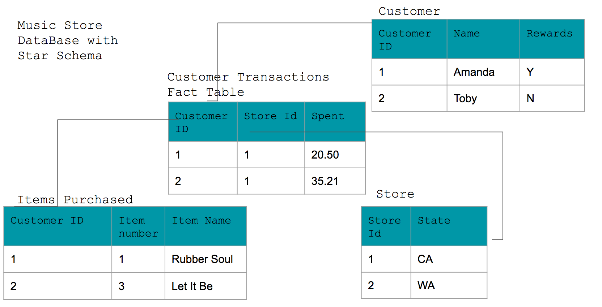

# Relational data models

**Learning objectives**: normalization, denormalization, fact/dimension tables, and different schema models

**Database**: A set of related data and the way it is organized
**Database Management System**: Computer software that allows users to interact with the database and provide access to al the data

**Codd’s Rules**

**Rule 1** The information rules:
All information in a RD is represented explicitly at the logical level and in exactly one way - by values in tables

## Relational importance
- Standardization of data model
- Flexibility of adding and altering tables
- Data integrity
- Standard Query Language
- Simplicity
- Intuitive Organization

## OLAP vs OLTP
**OLAP** Online Analytical Processing - complex analytical and ad hoc queries - optimized reads - aggregations
**OLTP** Online Transactional Processing - less complex queries in large volumes - crud

## Structuring your database
**Normalization** - reduce data redundancy and increase data integrity - structure in normal forms 
**Denormalization** - must be done in read heavy workloands to increase performance

## Normalization

**The objective of Normal Form**
1. Free the database from unwanted insertions, updates * deletion dependencies
2. To reduce the need for refactoring the database as new types of data are introduced
3. To make the relational model more informative to users
4. To make the database neutral to the query statistics

### Normal Forms
- How to reach First Normal Form (1NF):
    - Atomic values: each cell contains unique and single values
    - Be able to add data without altering tables
    - Separate different relations into different tables
    - Keep relationships between tables together with foreign keys
- Second Normal Form (2NF):
    - Have reached 1NF
    - All columns in the table must rely on the Primary Key
    E.g. Store - Customer separated
- Third Normal Form (3NF):
    - Must be in 2nd Normal Form
    - No transitive dependencies ( e.g. separate extra field lead singer from winner record)
    - Remember, transitive dependencies you are trying to maintain is that to get from A-> C, you want to avoid going through B.

**When to use 3NF**:
When you want to update data, we want to be able to do in just 1 place. We want to avoid updating the table in the Customers Detail table (in the example in the lecture slide).


**1NF**

Album ID, Album Name, Artist Name, Year, **List of songs**
<br>to 
<br>Album ID, Album Name, Artist Name, Year, **Song name** (row for each song)

**2NF**

Album ID, Album Name, Artist Name, Year, **Song name**
<br>to
<br>Album ID, Album Name, Artist Name, Year
<br>Song ID, Album ID, **Song name**

**3NF**

Album ID, Album Name, Artist Name, Year
<br>Album ID, Album Name, **Artist Name**, Year
<br>Song ID, Album ID, Song name
<br>to
<br>Album ID, Album Name, Artist ID, Year
<br>Song ID, Album ID, Song name
<br>Artist ID, **Artist Name**

## Denormalization
- make sure you keep data consistent
- reads will be faster
- writes will be slower
- will take up more space

## Fact and Dimension Tables
- https://en.wikipedia.org/wiki/Dimension_(data_warehouse)
- https://en.wikipedia.org/wiki/Fact_table

**Facts Tables**
- measurements, metrics or facts of a business process
- events that are actually happened
- e.g. transactions
- aggregation of data but not ment to be updated
- normally ints or numbers

**Dimension Tables**
- a structure that categorizes facts and mesures in otder to enable uses to answer business questions
- e.g. people, products, place and time
- all the other data not included in facts: customer information, information about products
- will have one or more facts table linked with a foreign key

 "Dimensions and Facts"

### Schemas
1. Star Schema
2. Snowflake Schema

**Star Schema**
- one or more fact tables referencing any number of dimension tables
- benefits
    - denormalize schema
    - simplify queries (with joins)
    - facts aggregations (count groupby)
- drawbacks
    - issues that come with denormalization
    - data integrity (duplicate data)
    - decrease query flexibility
    - many to many relationship (1 to 1 supported)
 "Star schema"

**Snowflake Schema**
- logical arrangement of tables in a multidimensional database
- centralized fact table conected to multiple dimensions
- multiple levels of relationship, with child tables
- star schema is a simplified case of the snowflake schema
- allows for many to many relationships
- more normalized, usually only 1NF and 2NF

**Upsert**

```
ON CONFLICT (fields) 
DO NOTHING;
```

```
ON CONFLICT (customer_id) 
DO UPDATE
    SET ...
```

